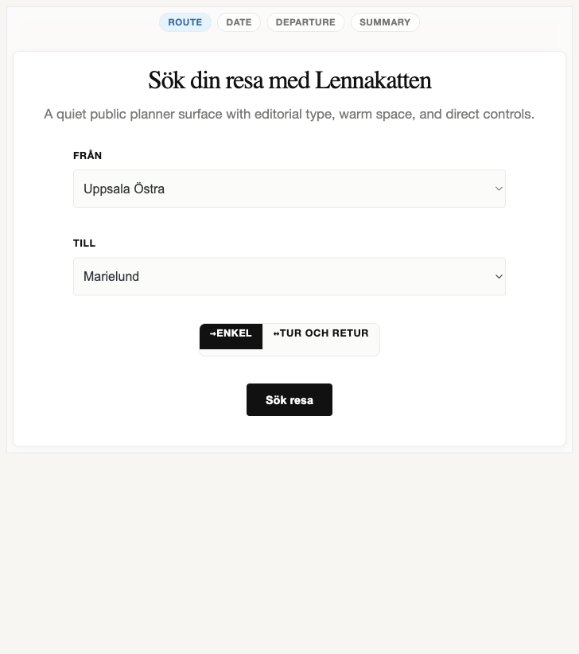
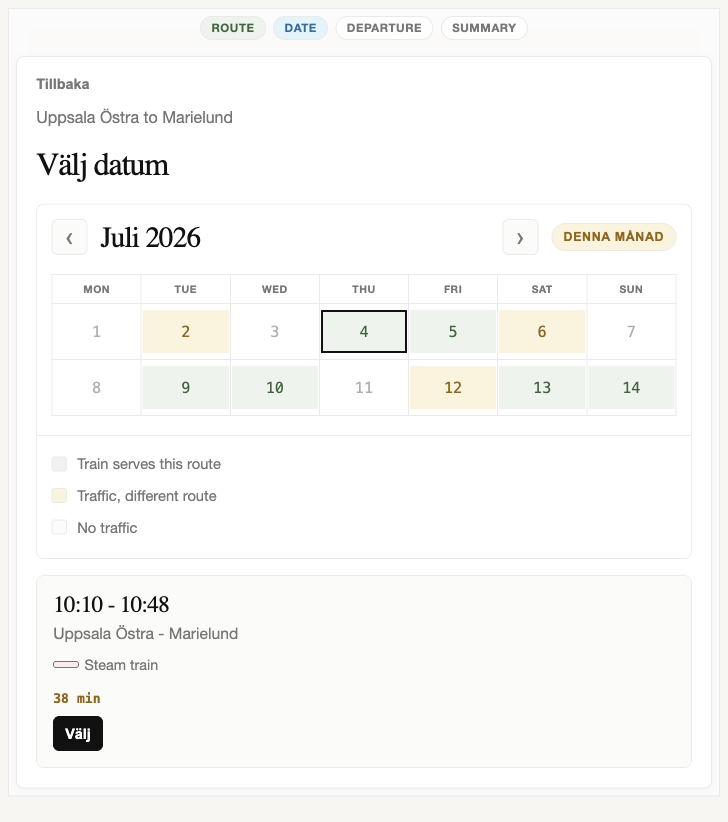
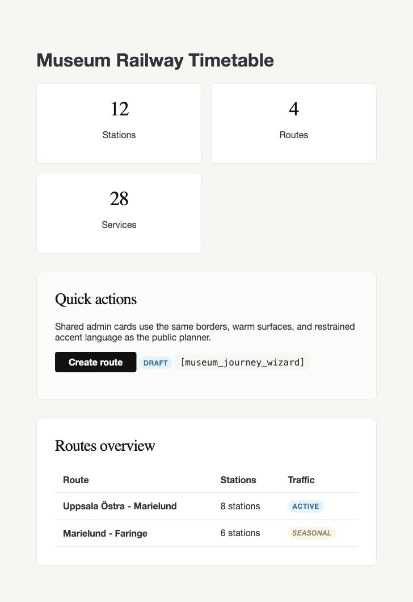

# Design

The `ui-mini` branch moves Museum Railway Timetable toward a premium, utilitarian minimalist interface: warm white surfaces, charcoal text, restrained borders, editorial headings, and sparse pastel state colors.

## Screenshots

### Journey Search

The public journey wizard uses a warm bone canvas with a single white panel, high-contrast serif heading, compact progress badges, and direct form controls. Primary actions are solid charcoal with no decorative shadow.

### Journey States

Calendar and trip states use muted semantic pastels instead of saturated railway colors. Green marks a valid route date, yellow marks traffic on another route, and neutral cells mark unavailable days. Trip cards stay flat, bordered, and scannable.

### Admin Components

Shared admin cards, sections, badges, buttons, and inline code now use the same visual language as the public planner: `1px` light borders, warm surfaces, small uppercase badges, black primary buttons, and soft document-style spacing.

## Design Principles

- Use warm monochrome as the base: `#ffffff`, `#fbfbfa`, `#f7f6f3`, `#eaeaea`, `#2f3437`, and `#111111`.
- Reserve color for state and meaning, using pale red, blue, green, and yellow accents.
- Keep components flat: borders carry structure, shadows stay extremely subtle, and buttons have crisp `4px` to `8px` radii.
- Use editorial type for large moments and compact sans-serif UI text for controls, tables, badges, and forms.
- Avoid decorative gradients, saturated brand blocks, oversized shadows, generic placeholder content, and promotional copy.

## Implementation Notes

The main public redesign lives in `assets/journey-wizard.css`. Shared admin alignment lives in `assets/admin-base-tokens.css`, `assets/admin-base-components.css`, and `assets/admin-components-ui.css`.

The screenshots in `docs/design/` were generated from a static local preview that imports the real CSS from this branch.
