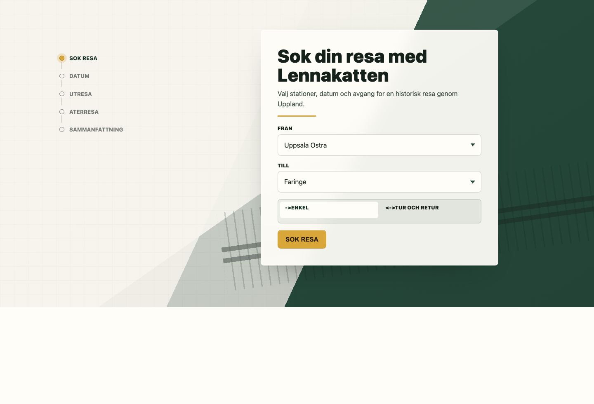
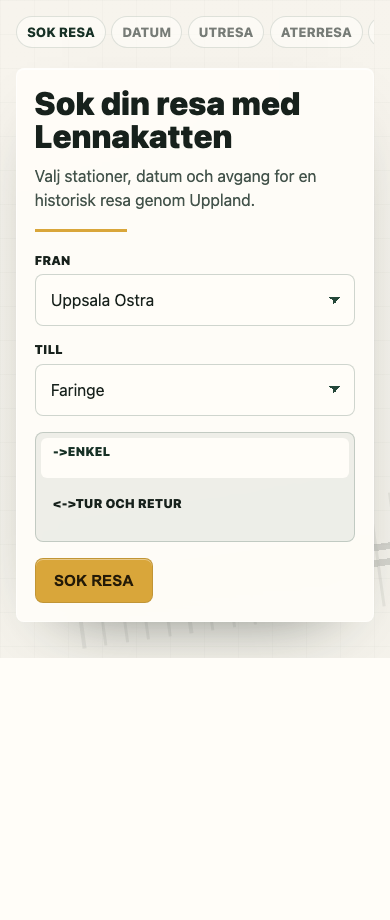
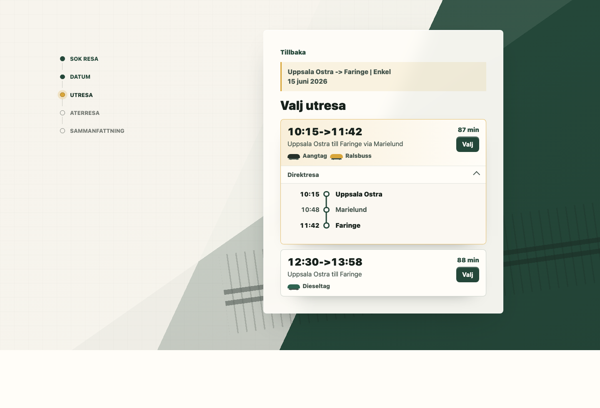

# Design

This branch redesigns the public journey wizard as a quiet, operational interface for a heritage railway. The goal is to make the booking flow feel specific to Lennakatten without turning it into a marketing hero or a generic card grid.

## Screenshots

## Direction

The visual language is built around railway materials: paper, ink, brass, and deep painted green. The hero uses an asymmetric split with a subtle track motif so the form feels placed in a railway context while remaining the first usable surface on the page.

The form panel is intentionally compact and task-focused. Labels sit above controls, the trip type uses a segmented control, and the primary action has a restrained brass accent. The design keeps large decorative surfaces out of the workflow and uses line, spacing, and contrast to separate states.

The stepper becomes a vertical route marker on desktop and a horizontal, scrollable status rail on mobile. This keeps progress visible without taking over the small-screen layout.

Trip results use dense but readable cards. Times are prominent, durations sit in a consistent side column, vehicle badges reuse the train-mark motif, and expanded details use a simple timeline rather than another nested card.

## Interaction And States

The CSS covers the dynamic states generated by `assets/journey-wizard.js`: loading and empty placeholders, inline errors, selected calendar days, expanded trip details, selected journeys, and the price table. Motion is limited to opacity/transform-based entry, button press feedback, active-step pulse, and skeleton shimmer. `prefers-reduced-motion` collapses animation duration for users who request less movement.

## Responsive Notes

The desktop layout uses two grid columns: progress on the left, planner panel on the right. Below `58rem`, it collapses to one column, turns the stepper into a horizontal rail, and clamps panel/control widths to prevent horizontal overflow. The mobile screenshot is part of the design contract because the wizard is likely to be used by visitors already on-site or planning travel from a phone.

## Implementation

The redesign is scoped to `assets/journey-wizard.css`. PHP and JavaScript contracts are unchanged, so the existing shortcode markup and dynamic rendering continue to drive the journey flow.
