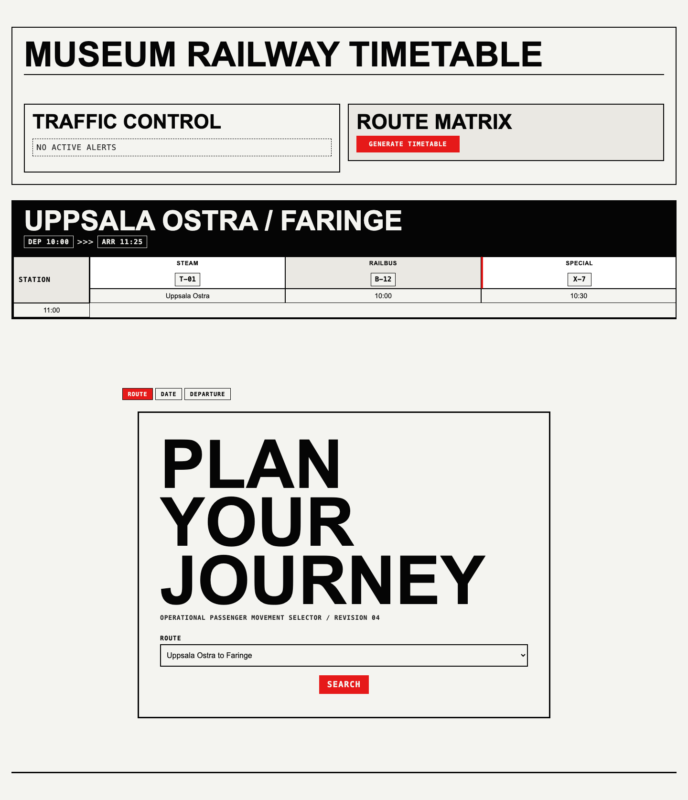
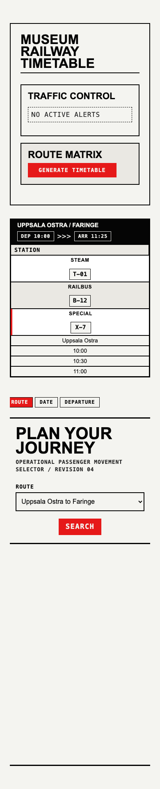

# Design Direction

This branch redesigns Museum Railway Timetable around a Swiss Industrial Print system: stark documentation surfaces, rigid route grids, oversized black typography, and one aviation-red signal color. The interface should feel like a station operations sheet or machinery manual rather than a consumer travel widget.

## Screenshots

## Visual System

The chosen mode is light-substrate industrial print. The base palette is matte paper, carbon ink, and hazard red. Blue, green, yellow, rounded cards, soft shadows, and decorative gradients have been removed from the redesigned surfaces.

Typography carries most of the identity. Large headings use heavy uppercase sans-serif forms with compressed line height. Operational labels, buttons, step indicators, and route metadata use monospace uppercase text with generous tracking so they read like technical markings.

Layout is intentionally mechanical. Components use square corners, hard borders, thick route headers, and timetable cells that align to visible grid lines. The public journey wizard keeps its functional flow, but its hero and controls now read as a route-selection instrument: large structural title, small telemetry lede, bordered fields, and red command buttons.

## Implementation Notes

The primary shared changes live in `assets/admin-base-tokens.css`, where the token system now maps legacy color names onto the industrial print palette. That lets existing admin components inherit the new language without forcing a broad markup rewrite.

The public journey experience is handled in `assets/journey-wizard.css`. It uses the same substrate, ink, and red rules so the shortcode and admin views feel like one system.

Timetable overview changes in `assets/admin-timetable-overview-layout.css` and `assets/admin-timetable-overview-components.css` remove the previous rounded, gradient treatment and replace it with operational route blocks and high-contrast service cells.

## Rules Of The Direction

- Use off-white paper as the substrate and black as the default text and line color.
- Use hazard red only for active state, action, warning, or special service emphasis.
- Keep corners square.
- Prefer hard borders and grid lines over shadows.
- Keep labels and metadata uppercase and monospace.
- Avoid decorative gradients, soft cards, pastel accents, and circular status marks.
