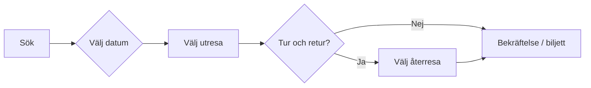

# UI-plan – bokningsflöde (mockup-referens)

Plan för att realisera skärmarna som beskrivs i **`docs/mockups/`**. Detta är en **målbild** för framtida frontend (shortcode, block eller temaintegration); nuvarande plugin fokuserar på tidtabeller i admin – planen binder ihop design och tekniska steg.

**Mockup-filer**

| Fil | Skärm |
|-----|--------|
| `sok-din-resa.png` | Hero + sök (enkel / tur–retur, från–till) |
| `valj-utresa.png` | Lista över utresor, accordion, tidlinje, priser |
| `valj-datum.png` | Kalender med trafikdagar och teckenförklaring |
| `valj-aterresa.png` | Vald utresa + lista över returer (varningar, tidlinje) |

---

## 1. Användarflöde

**Obs:** I mockup kan ordningen mellan datum och reslista variera produktmässigt; API:t bör stödja både “datum först” och “tider per datum” beroende på datakälla.

---

## 2. Komponenter (återanvändning)

| Komponent | Syfte | Viktiga tillstånd |
|-----------|--------|-------------------|
| **HeroLayout** | Foto bakgrund + centrerad mörk panel | Responsiv höjd, läsbar kontrast |
| **SearchPanel** | Rubrik + formulär | — |
| **TripTypeToggle** | Enkel ↔ Tur och retur | Aktiv = accentbakgrund, ikon pil / dubbelpil |
| **StationField** | Från / Till | Placeholder, autocomplete (data från stationer) |
| **PrimaryButton** | t.ex. `SÖK RESA` | Disabled vid ogiltig input |
| **WizardHeader** | Tillbaka + rutt + datum | Återanvänds på alla steg efter sök |
| **TripCard** | En avgång | Kollapsad / expanderad, vald |
| **VehicleBadge** | Ångtåg / Dieseltåg / Rälsbuss + nummer | Färg per typ (se stil) |
| **ServiceAlert** | t.ex. ersatt lok, brandrisk | Ikon + kort text |
| **RequestStopHint** | Behovsuppehåll `(P)` | Hjälptext |
| **JourneyTimeline** | Stationer, tider, segmenttid | Undernoder “visa/dölj passerade stationer” |
| **TransferBlock** | Byte, väntetid | Mellan två noder samma station |
| **PriceTable** | Biljetttyper × åldersgrupper | Tabell eller kort på små skärmar |
| **CalendarMonth** | Månad + pilar + “Denna månad” | Månadsbyte |
| **DateCell** | En dag i rutnät | Tillgänglig / otillgänglig / “trafik men ej vald resa” |
| **DateLegend** | Förklaring av färger | Under kalendern |

---

## 3. Stil – design tokens

Värdena är **härledda från mockups** och ska finjusteras mot riktig varumärkesprofil (RGB från designfiler när de finns).

### 3.1 Färg

| Token (förslag) | Användning | Mockup |
|-----------------|------------|--------|
| `--mrt-ui-green-900` | Huvudpanel, kortbakgrund | Mörk skogsgrön |
| `--mrt-ui-green-700` | Kalender: valda trafikdagar (olivgrön cell) | Mörkare grön än panel om så i bild |
| `--mrt-ui-accent` | Primär knapp, aktiv flik tur/retur, tillbaka-länk | Gul / guldgul |
| `--mrt-ui-on-green` | Rubriker och etiketter på grön yta | Vit |
| `--mrt-ui-surface` | Formulärfält, kalenderkort, expanderad detalj | Vit |
| `--mrt-ui-muted` | Inaktiv flik “Enkel”, diskret kant | Ljusgrå bakgrund |
| `--mrt-ui-border-subtle` | Rutnät kalender, tabellinjer | Ljusgrå |
| `--mrt-ui-warning` | Varningsikon bakgrund | Gul cirkel |
| `--mrt-ui-railbus` | Rälsbuss-badge | Orange ton (mockup) |
| `--mrt-ui-train` | Tåg-badge | Grön ton |

**Kontrast:** Vit text på `--mrt-ui-green-900` ska uppfylla WCAG AA där det är brödtext; gul knapp med **mörk text** (som i mockup) behålls.

### 3.2 Typografi

| Element | Stil (mockup) |
|---------|----------------|
| Huvudrubrik (t.ex. “Sök din resa…”) | Sans-serif, fet, centrerad, vit |
| Stegrubrik (“Välj utresa”) | Större, fet, vit |
| Etiketter (Från, Till) | Vit, mindre än rubrik |
| Knapp `SÖK RESA` | Versaler, fet, mörk text på gul |
| Brödtext / hjälp | Sans-serif, normal, mörk på vit yta |
| Tabell priser | Tydlig kolumnheader, alternerande rader (ljusgrå/vit) |

**Font-stack (förslag):** system-ui eller befintlig temafont; undvik fler än två vikter om prestanda är viktig.

### 3.3 Layout och ytor

| Mönster | Beskrivning |
|---------|-------------|
| **Hero** | Fullbredds bakgrundsbild; innehåll i maxbredd centrerat (t.ex. 32–40 rem panel). |
| **Panel** | Rak rektangel (mockup utan kraftigt rundade hörn); generös padding. |
| **Kalender** | Vit “kort” inuti grön panel; tunn **vit ram** runt ytterpanel i mockup. |
| **TripCard** | Vertikal stack; chevron ned/upp för expand; gul `Välj`-knapp där mockup visar. |
| **Tidlinje** | Vertikal linje + noder; tidsdelta och fordon mellan noder. |

### 3.4 Ikoner och badge-regler

- **Fordon:** liten silhuett + etikett (`Ångtåg 71`, `Dieseltåg 61`, `Rälsbuss 93`).
- **`(P)`** – behovsuppehåll: gul markering + förklarande text.
- **`!`** – driftstörning / ersättning: gul varningsikon + kort meddelande.

### 3.5 Interaktion

| Interaktion | Förväntat beteende |
|-------------|---------------------|
| Tur/retur | Styr om steg “välj återresa” visas. |
| Accordion | Max en expanderad kort åt gången (kan beslutas UX-mässigt). |
| Kalender | Endast klickbara celler för tillåtna dagar; övriga visuellt avstängda. |
| “Visa/dölj passerade stationer” | Toggle av undernoder i tidlinjen. |

---

## 4. Data och backend (koppling till plugin)

- **Stationer och rutter** finns i pluginets datamodell; offentligt API behöver **säkra endpoints** eller serverrendering via shortcode med nonce där det är lämpligt.
- **Tider, byten, fordon** måste mappas från verkliga `Service` / importdata – mockup visar fält som kan vara **tomma** om data saknas (visa inte tomma rader).
- **Priser** i mockup är exempel – källa kan vara inställningar, manuell tabell eller extern biljettsystem (scope utanför ren tidtabell).

---

## 5. Faser (implementation)

| Fas | Innehåll | Leverans |
|-----|----------|----------|
| **A** | CSS-variabler + HeroLayout + SearchPanel statisk | En sida som matchar färger/typografi |
| **B** | TripTypeToggle + StationField med riktig data | Sök som validerar och går vidare |
| **C** | WizardHeader + TripCard (kollaps) + VehicleBadge | Lista utresor |
| **D** | JourneyTimeline + PriceTable (data-driven) | Expanderat kort komplett |
| **E** | CalendarMonth + DateCell + legend | Datumsteg med trafikflaggor |
| **F** | Returflöde + ServiceAlert | `valj-aterresa`-paritet |
| **G** | Responsivitet (tabell → kort), tillgänglighet (tangentbord, ARIA) | Polish |

---

## 6. Öppna frågor

- Ska boknings-UI leva i **samma plugin** som shortcode, eller som **barn-tema / separat paket**?
- Biljettbetalning: endast **information** i v1 eller integration senare?
- En källa för “vilka datum trafikerar vald linje” – samma som tidtabell-import?

---

*Senast uppdaterad: 2026-03 – baserad på `docs/mockups/*.png`.*
